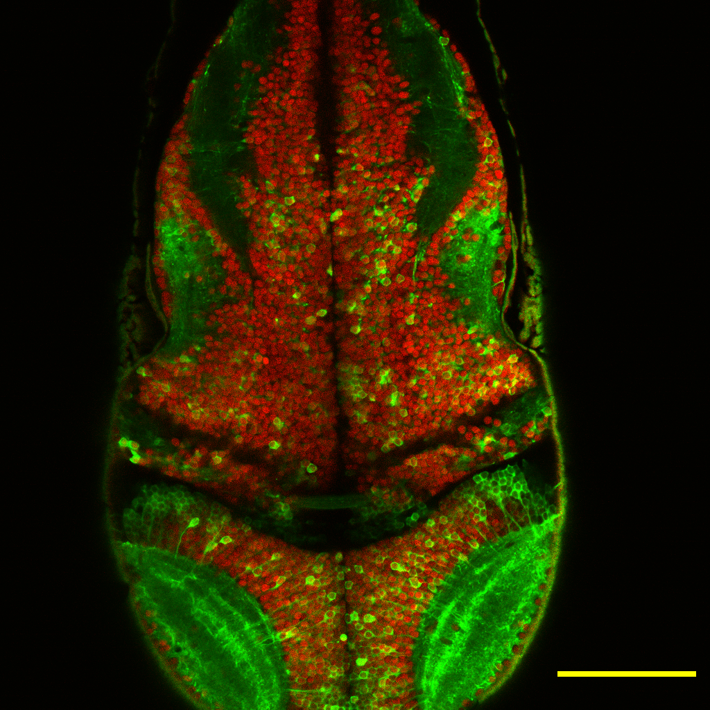
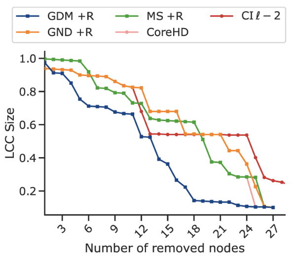

# 🔖CLG Volumetric Imaging & Analysis Framework

**Comprehensive Label–Guided (CLG) Volumetric Imaging Enables Accurate Single-Neuron Mapping and Network Reconstruction and Analysis**

   

| Zebragdm LCC Reduction Curve| Other Methods' LCC Reduction Curve|
|------|------|
|  |  |    


| CPU Version of Zebragdm| GPU Version of Zebragdm|
|------|------|
|  |  |   


**Zebragdm on the Corruption Dataset**
   


## 💡 Introduction

This repository contains the complete analysis pipeline code used in the paper **"Comprehensive Label–Guided Volumetric Imaging Enables Accurate Single-Neuron Mapping and Network Reconstruction and Analysis"** 

CLG is a framework that integrates dual-channel imaging (nuclear localization structural imaging + cytoplasmic calcium signaling functional imaging) with deep learning analysis. It is designed to address the common **axial overcounting** problem in two-photon volumetric imaging, enabling high-precision single-neuron extraction and unbiased whole-brain neural network reconstruction.

If you want to quickly use our models and algorithms, please read the `README.md` file carefully.


## 📌 Pipeline Overview

The entire processing pipeline is divided into the following four main modules:

1. **🟥 Image Preprocessing:** Denoising, deconvolution, and registration of structural and functional images.  
2. **🟧 3D Structural Segmentation:** Deep learning-based segmentation of cell nuclei.  
3. **🟪 Signal Extraction & 3D Calibration:** Extraction of functional signals using structural information, with correction of over-counting.  
4. **🟦 Network Construction & Analysis:** Functional connectomics analysis, network dismantling, and avalanche analysis.

---

## 1️⃣ Image Preprocessing

### 🔴 Structural Imaging - mRuby3
To improve the accuracy of nucleus segmentation, we first perform sparse deconvolution and local contrast normalization on the mRuby3 channel.

*   **🔸Sparse Deconvolution :**
    *   We employed the **Sparse Deconvolution** algorithm to improve the image signal-to-noise ratio (SNR) and resolution.
    *   **External Link:** [Sparse Deconvolution MATLAB Package (Windows Source)](https://github.com/WeisongZhao/Sparse-SIM/tree/master/src_win) (Reference: Zhao et al., Nat Biotechnol 2022)
    *   **Usage in CLG:** The main parameters are as follows:`iterations=120`, `z_axis_continuity=1`, `image_fidelity=150`, `sparsity=6`, `deconv_iterations=8`。

*   **🔹Local Contrast Normalization:**
    *   To address the uneven light intensity across the tissue depth, we implemented sliding window normalization.
    *   **Our Code:** `main/preprocessing/local_normalization.py` (Python script for Local Contrast Normalization)

### 🟠 Functional Imaging - GCaMP6s
*   **🔸Motion Correction:**Perform rigid or non-rigid motion correction using NoRMCorre.**
    *   **External Link:** [NoRMCorre](https://github.com/flatironinstitute/NoRMCorre)
    *   **Usage in CLG:** For 512×512 images, the main parameters are `patch_size=128`, `overlap=32`, `iterations=2`；For 1024×1024 images，it is recommended to use `patch_size=256`, `overlap=64`, `iterations=2`
    *   **Our Code:** `main/registration/run_functional_registration.m`
    
*   **🔹Denoising:** Denoising using the self-supervised deep learning method **SUPPORT**.
    *   **External Link:** [SUPPORT](https://github.com/FlorentF9/SUPPORT)
    *   **Usage:** Perform training and inference on time series features.

---

## 2️⃣ 3D Structural Segmentation

This is one of the core steps of the CLG framework, which utilizes the nuclear channel to provide authentic 3D neuron position information.

*   **🟤Deep Learning Segmentation:** We used the **Cellpose 2** algorithm.
    *   **External Link:** [Cellpose](https://github.com/MouseLand/cellpose)
    *   Specific version link：
    *   **External Link:** [Cellpose2](https://github.com/MouseLand/cellpose/releases/tag/v2.3.2)
    *   **Our Implementation:**
        *  We retrained the Cellpose model using preprocessed images and manually annotated data.
        *  Reconstruct the complete 3D nuclear mask using Cellpose's 3D mode (by stitching the 2D slice segmentation results).
    *   **Training/Inference Script:** 
        We performed model training using the following command:
        ```bash
        python -m cellpose --train --use_gpu --dir ./trainset --test_dir ./valset --pretrained_model cyto2 --learning_rate 0.1 --weight_decay 0.0001 --n_epochs 500 --verbose
        ```
    *   **Pre-trained Models:** Our fine-tuned Cellpose model for zebrafish. Model path:`main/models/clg_cellpose_model_for_zebrafish.zip` 

---

## 3️⃣ Signal Extraction & 3D Calibration

This step maps the functional signals onto the 3D structure and corrects for axial overcounting (i.e., the same cell being counted multiple times across different z-slices).

*   **🔵Registration:** Register the functional images to the structural image template (see NoRMCorre in the earlier functional image processing section).
*   **🟣3D Calibration (The "CLG" Step):**
    *   **Principle:** By leveraging the unique ID assigned to each nucleus in the 3D nuclear mask, the same neuron spanning multiple imaging layers (Z-planes) can be identified.
    *   **Operation:** Merge (average) the ROI signals from multiple layers belonging to the same 3D ID, thereby eliminating redundant counting.
    *   **Our Code:** `main/extraction/step2_signal_extraction_calibration.ipynb` (Python notebook for signal extraction and CLG 3D calibration)
*   **⚫️ΔF/F Calculation:**
    *   Use **AllenSDK** to compute the relative fluorescence change rate (ΔF/F₀ or ΔF/F).
    *   **External Link:** [AllenSDK](https://github.com/AllenInstitute/AllenSDK)
    *   **Usage:** `allensdk.brain_observatory.dff` module.

You can try this step using our test dataset at the Zenodo Link: XXX. And after downloading the dataset, you should put the file `fish4_example` in the path `main/extraction` 

Due to Zenodo’s storage limits, we were unable to upload the full dataset.  Therefore, the fish4_example folder contains only one slice (z15).  Our code handles this automatically: if a slice is missing, it prints a message and skips it.  Feel free to use this demo data to get familiar with the pipeline, then try Signal Extraction & 3D Calibration on your own dataset.  If you need the complete raw data, please contact us!

---

## 4️⃣ Network Construction & Analysis

Based on the calibrated single-neuron activity data, construct a functional network and perform topological analysis.

### 🟤 Network Construction
*   **Processing:** Denoising (PCA) → Correlation Calculation (Pearson Correlation)

If you want to compute the correlation matrix of your time-series data and choose a threshold based on the distribution of correlations, please run the code file `main/networkdismantling/corrdistributionon.py`. In this script, we provide the distribution lines for four percentiles (95 %, 90 %, 85 %, 80 %) as candidate thresholds, and you will also obtain the corresponding visualization. You can choose an appropriate threshold and correlation-value rule according to the observed distribution to construct your network.

```bash
python main/networkdismantling/corrdistributionon.py
```

Once you have selected an appropriate threshold and correlation-value rule for building your network, proceed by running the code file `main/networkdismantling/bulidyournetwork.py`. In the script, set the input and output paths for your data file, specify your chosen rule for selecting correlation values, and define the threshold you have decided on. Then execute the script. We have also included network-visualization output file in the code. You can use the generated network plot to verify whether your chosen threshold and correlation-value rule meet your expectations.

```bash
python main/networkdismantling/bulidyournetwork.py
```


*   **NetworkX:** Used to compute metrics such as Degree, Eigenvector Centrality, and Communicability.
    *   **External Link:** [NetworkX](https://networkx.org/)
    *   **Analysis Script:** `main/analysis/step3_network_construction_analysis.ipynb`


### 🔴 Advanced Network Analysis
*   **🔸Coarse-Graining:** To handle large-scale networks, we first perform coarse-graining.
    *   **Code link:** `(https://www.github.com/Bmunn/ICG)`
*   **🔹Network Dismantling (GDM):**
    *   We have adopted and enhanced a machine-learning-based graph dismantling algorithm (**GDM**).
    *   **Modification:** We expanded the training set—incorporating Watts–Strogatz and modular graph models—to better capture the characteristics of biological neural networks.
    *   **Original Algorithm Reference:** [GDM by Grassia et al.](https://github.com/marcograssia/GDM) (Check reference [44] in paper)

**Our Network Dismantling Code**: If you are satisfied with the network you have built, it’s time to start dismantling it! We provide several code files to help you dismantle your network ( `main/networkdismantling/dismantling_XXX.py `), each runnable on either CPU or GPU. Specifically, we offer dismantling strategies based on degree centrality, betweenness centrality, and a new method—`zebragdm`—that incorporates multiple optimizations on Marco Grassia et al.’s GDM framework (Machine-learning dismantling and early-warning signals of disintegration in complex systems. *Nature Communications*, 2021, 12(1): 5190). If you wish to use a dismantling method that incorporates multiple metrics, please apply the `zebragdm` model to your data, and you will need to adjust the relevant parameters in the code. Conversely, if you opt for a single-metric dismantling method, no parameter adjustments are necessary. Choose the approach that best suits your research question, and set your dismantling target value directly in the code file. The final outputs will include detailed information on the dismantled nodes and a visualization of the dismantling process.

```bash
python main/networkdismantling/dismantling_XXX.py
```

**Tip: GPU acceleration can speed up dismantling, but it incurs additional cost. If your network is small—e.g., only a few hundred nodes—using the CPU implementation is usually the better choice.**

---

## 🔧 Dependencies

You can use the following command to quickly set up an environment with CUDA 11.8.

```bash
git clone https://github.com/PKUCHENLAB/CLG-Volumetric-Imaging-Analysis-Framework.git
```

```bash
cd CLG-Volumetric-Imaging-Analysis-Framework/
```

```bash
micromamba env create -f environment.yml -n zebragdm
```

```bash
micromamba activate zebragdm
```


## ✨ Citation

If you use this code or refer to our method, please cite our paper:

> Comprehensive Label–Guided Volumetric Imaging Enables Accurate Single-Neuron Mapping and Network Reconstruction and Analysis.

---

### 📮 Contact

If you have any questions, please contact: [liuxiang_paul@pku.edu.cn][junjie88@connect.hku.hk]


